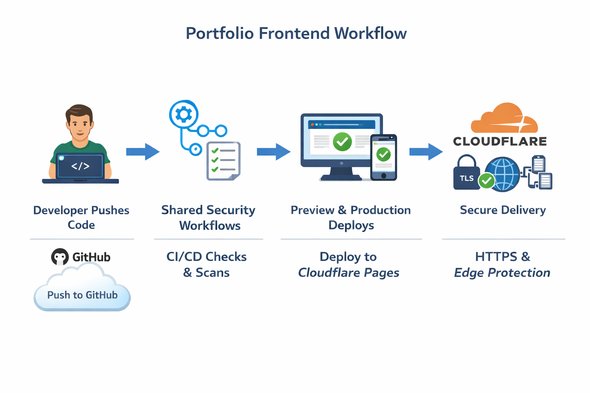

# Frontend Portfolio

## Summary

### Overview

This repository hosts the Cloudflare Pages frontend portfolio application. The repository focuses on application code and deployment. Shared security logic lives in separate repositories to keep this repository minimal and clear.

## Tech Stack

- Node.js 20 with npm  
- React with Vite and Tailwind CSS  
- Cloudflare Pages for hosting and preview deployments  
- Docker for local builds and security scanning
- Kubernetes manifests and cluster security  
- GitHub Actions for CI and deployment  

## Repository Scope

This repository contains only frontend source code and deployment workflows.

All reusable security workflows run from connected repositories and are consumed through workflow calls:

1. [CI CD and security pipelines](https://github.com/asadyare/portfolio-ci-cd-security)
2. [Threat modeling and risk analysis](https://github.com/asadyare/portfolio-threat-model)
3. [Kubernetes Deployment and security](https://github.com/asadyare/portfolio-k8s-security)
4. [Daily security automation](https://github.com/asadyare/portfolio-daily-security)

### Central Portfolio Reference

Primary portfolio index and documentation
[Central repository](https://github.com/asadyare/devsecops-portfolio-asad)

## Architecture diagram

  

### Pull Request Flow

On every pull request, GitHub Actions triggers shared security workflows from the connected repositories.

Checks include:

- Secret scanning  
- Static analysis  
- Dependency auditing  
- Docker build  
- Container image scanning  

When all checks pass, Cloudflare Pages creates a preview deployment. GitHub posts the preview URL as a pull request comment.

### Main Branch Flow

On every push to the main branch, the same shared security workflows run again.

When checks pass, the site builds and deploys to Cloudflare Pages production.

## Contact

You can contact me via [walasaqo@gmail.com](mailto:walasaqo@gmail.com) or connect with me on [LinkedIn](https://www.linkedin.com/in/asad-hassan-20b540313/).

## License

This portfolio is licensed under the MIT License - see the [LICENSE](LICENSE) file for details.
